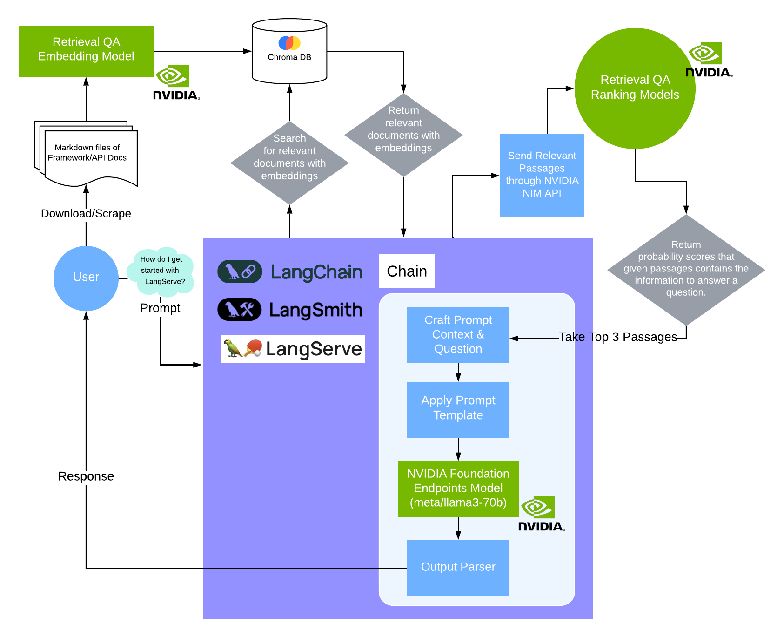

## NVIDIA LangChain DocsAgent

### Demo Video

https://github.com/tsunami776/NVIDIA-LangChain-DocsAgent/assets/43768723/87d0e548-39d6-43cf-8477-576904481c20

### What Inspired Me
I thought it would be useful to have an agent that can answer questions related to corresponding framework/API documentation. This agent can grow its knowledge base by importing more information or documents into its database. So, when I want to look something up or know how a function or integration works, I only have to ask the agent in natural language.

### Use Case
Use natural language to ask questions about an API or framework documentation.

### Workflow
- Download or Scrape Content from Docs as Markdown
- Create Embeddings and Import Chunks into Chroma DB: Use NVIDIA embedding API.
- User Interaction: Ask questions like "How do I write a chain in LangChain?"
- Retrieve Relevant Documents: LangServe searches Chroma DB based on similarities.
- Rank Documents: Chroma DB returns relevant documents; LangServe sends these to NVIDIA Retrieval QA Ranking API to get ranked scores.
- Craft Custom Prompt: LangChain crafts a custom prompt with context and question using top 3 passages returned from NVIDIA QA Rank API. 
- Send Prompt to NVIDIA Hosted LLM: LangChain sends the crafted prompt.
- Return Response: NVIDIA hosted LLM returns a response which LangChain parses and presents to the user.

### Workflow Diagram:


### What Was Used in This Project
- **LangChain**: LangChain is used as the core framework for building the Retrieval-Augmented Generation (RAG) agent. It facilitates the creation and management of the language model interactions, ensuring smooth integration between the various components such as document retrieval, prompt crafting, and response generation.

- **LangSmith**: LangSmith provides advanced monitoring and analytics capabilities for the LangChain framework. It helps in tracing and debugging the interactions within the RAG agent, ensuring that each step in the process is correctly executed and optimized.

- **LangServe**: LangServe is used to deploy and manage the agent as a web service. It handles incoming user queries, interacts with the Chroma database, and manages the workflow of querying the language models and retrieving relevant information.

- **langchain_nvidia_ai_endpoints, NVIDIA AI Foundation endpoints**: This package is used to integrate NVIDIA AI Foundation endpoints with LangChain. It provides access to NVIDIA's advanced AI models for embedding generation, document ranking, and large language model (LLM) interactions.

- **Chroma Database**: Chroma is used as the vector database to store the embeddings generated from the documentation. It facilitates fast and efficient similarity searches, allowing the agent to quickly retrieve relevant documents based on user queries.

- **NVIDIA NIM API (nv-rerank-qa-mistral-4b)**: This API is used to re-rank the retrieved documents based on their relevance to the user query. It ensures that the most pertinent documents are prioritized for the final response generation.

- **NVIDIA NIM API (nvidia/embed-qa-4)**: This API generates high-quality embeddings for the chunks of documentation. These embeddings are stored in the Chroma database and used for similarity searches.

- **NVIDIA NIM API (meta/llama3-70b)**: This API provides the large language model used for generating the final response to the user's query. It processes the crafted prompt and produces a coherent and accurate answer.

## Instructions to Run the Project

### Create Your Python Environment
- Python version = 3.10.13

### Environment Variables

```shell
export LANGCHAIN_TRACING_V2=true
export LANGCHAIN_API_KEY="your_langchain_api_key"
export LANGCHAIN_PROJECT="docs-agent"
export NVIDIA_API_KEY="your_nvidia_api_key"
```

### Install Dependencies

Root directory:
```python
pip install -r requirements.txt
```

### Start LangServe

```python
cd docs-agent/app

poetry install

langchain serve
```
### [Using Your Own Markdown Files]:
The example database included in this repo uses docs from LangChain v0.1 documentation. If you want to create your own database using your markdown files:

#### Add Your Files:
- Create a folder named `data/md_files/your_markdown_files`, and put markdown files in the folder

#### Edit `DATA_PATH`:
- In `create_db_small_batch.py`, change `DATA_PATH` to the directory path containing your markdown files

#### Create the Chroma DB:

```python
python create_db_small_batch.py
```

### Crawlers Used:
The following Jupyter notebooks and script were used to scrape and sanitize LangChain documentation:

```python
langchain-doc-crawler.ipynb
langchain-api-reference-crawler.ipynb 
md-sanitize-helper.py
```

### Limitations:
- Data Quality: The accuracy and reliability of the agent's responses are highly dependent on the quality and comprehensiveness of the documentation ingested. Incomplete or outdated documentation can lead to incorrect answers.

- Scalability: While the current implementation does not handle significant volume of data, scaling to much larger datasets or handling a high number of concurrent queries might require further optimization and resource allocation.

- Context Limitations: The agent's ability to provide accurate responses is limited by the context it can consider at any one time. Complex queries that require understanding long or multiple documents might challenge the agent's capabilities.

### References:
- [LangServe Chat Playground Launch](https://www.youtube.com/watch?v=bGUO26Bc-Sc&t=89s)
- [NVIDIA AI Foundation endpoints](https://python.langchain.com/v0.2/docs/integrations/chat/nvidia_ai_endpoints/)
- [LangChain RAG Tutorial](https://github.com/pixegami/langchain-rag-tutorial)
- [LangChain](https://python.langchain.com/v0.2/docs/introduction/)
- [LangSmith](https://docs.smith.langchain.com/)
- [LangServe](https://python.langchain.com/v0.2/docs/langserve/)
- [Chroma Database](https://docs.trychroma.com/getting-started)
- [NVIDIA NIM API (nvidia/embed-qa-4)](https://build.nvidia.com/nvidia/embed-qa-4/modelcard)
- [NVIDIA NIM API (nv-rerank-qa-mistral-4b)](https://build.nvidia.com/nvidia/rerank-qa-mistral-4b)
- [NVIDIA NIM API (meta/llama3-70b)](https://build.nvidia.com/meta/llama3-70b/modelcard)
